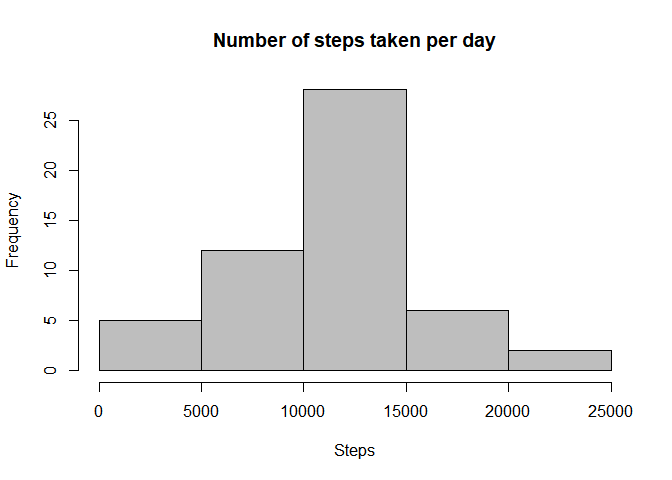
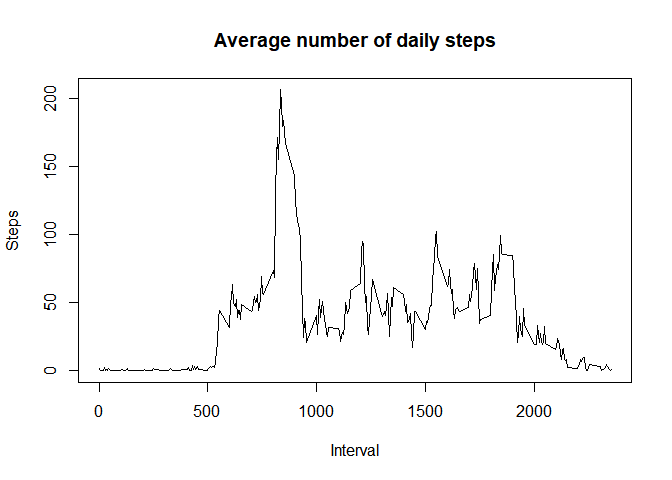
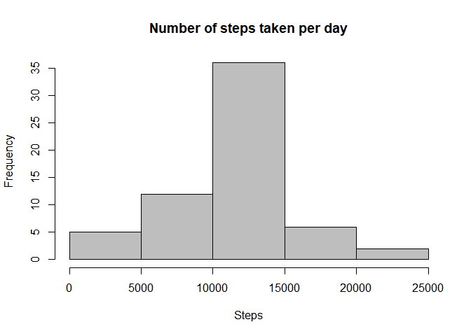
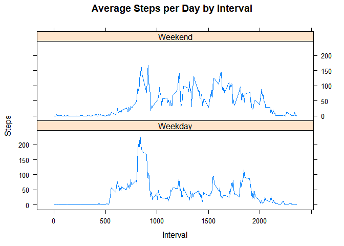

## Loading and preprocessing the data

```r
knitr::opts_chunk$set(echo = TRUE)

data <- read.csv("activity.csv")
```

## What is mean total number of steps taken per day?

```r
num_steps<-aggregate(steps~date,data,sum)
     hist(num_steps$steps,
     col ="gray",
     main ="Number of steps taken per day",
     xlab = "Steps")
```

<!-- -->
## Mean and Median

```r
mean_steps<- mean(num_steps$steps)
cat("Mean",mean_steps,"\n")
```

```
## Mean 10766.19
```

```r
median_steps<-median(num_steps$steps)
cat("Median",median_steps)
```

```
## Median 10765
```
## What is the average daily activity pattern?

```r
steps_interval<-aggregate(steps~interval,data,mean)
plot(steps_interval$interval,steps_interval$steps,
     type="l",
     xlab = "Interval",
     ylab = "Steps",
     main = "Average number of daily steps")
```

<!-- -->


```r
max_steps<- steps_interval[which.max(steps_interval$steps),1]
cat("Max number of steps",max_steps)
```

```
## Max number of steps 835
```
## Imputing missing values

```r
library(plyr)
missing_values<-sum(is.na(data))
cat("Missing values",missing_values)
```

```
## Missing values 2304
```

```r
clean_data <- ddply(data, ~interval, function(item) {

        item$steps[is.na(item$steps)] <- round(mean(item$steps, na.rm = TRUE));
        return(item);
    })
steps_cinterval<-aggregate(steps~date,clean_data,sum)
hist(steps_cinterval$steps,
     col ="gray",
     main ="Number of steps taken per day",
     xlab = "Steps")
```

<!-- -->

```r
mean_csteps<- mean(steps_cinterval$steps)
cat("Mean",mean_csteps,"\n")
```

```
## Mean 10765.64
```

```r
median_csteps<-median(steps_cinterval$steps)
cat("Median",median_csteps)
```

```
## Median 10762
```

## Are there differences in activity patterns between weekdays and weekends?

```r
weekdays <- c("Monday", "Tuesday", "Wednesday", "Thursday", "Friday")
clean_data$dow = as.factor(ifelse(is.element(weekdays(as.Date(clean_data$date)),weekdays), "Weekday", "Weekend"))
Steps_total <- aggregate(steps ~ interval + dow, clean_data, mean)
library(lattice)
xyplot(Steps_total$steps ~ Steps_total$interval|Steps_total$dow, main="Average Steps per Day by Interval",xlab="Interval", ylab="Steps",layout=c(1,2), type="l")
```

<!-- -->
